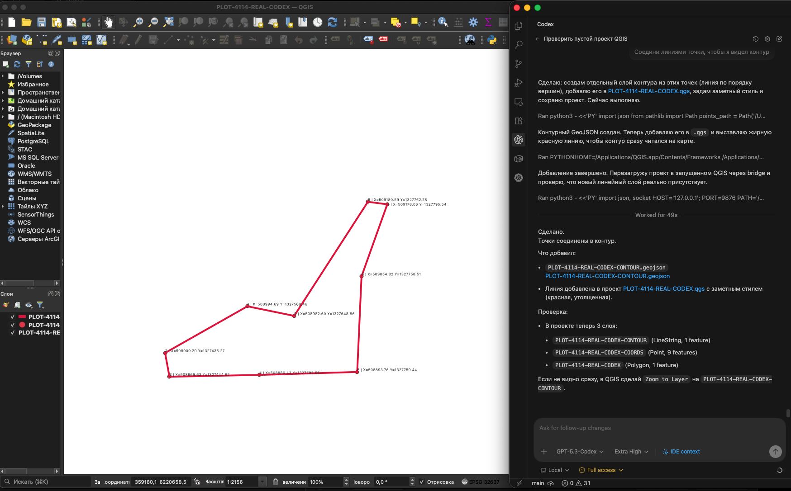

# MCP-QGIS

MCP-сервис и QGIS-плагин для управления геооперациями из LLM (через MCP) с фокусом на кадастровые сценарии.



## Связанный проект

- [QGIS-OC-CHAT](https://github.com/sergekostenchuk/QGIS-OC-CHAT) — companion-проект с QGIS chat plugin, OpenCode sidecar, HITL-подтверждением, RAG-контекстом и безопасным выполнением GIS tool workflows.

`MCP-QGIS` — базовый MCP/QGIS bridge и набор инструментов. `QGIS-OC-CHAT` показывает, как этот слой можно использовать в chat/plugin workflow с OpenCode-style planning.

## Usage

Use `MCP-QGIS` when an LLM workflow needs a local bridge into QGIS-related operations rather than a generic chat-only interface. The current server exposes health and tool endpoints over HTTP, so it can be wired into Codex, Claude Code, Antigravity, or another agent harness that can call local tools.

Typical local loop:

1. Start QGIS or prepare the local GIS workspace.
2. Start the MCP-QGIS server with `mcp-qgis run`.
3. Connect the agent client using one of the example profiles.
4. Execute small, reviewable GIS tool requests and keep QGIS as the source of truth for map/project state.

## Ecosystem relevance

Geospatial agent workflows are a strong OSS/Codex use case because useful work depends on local files, desktop state, domain-specific libraries, and user review. `MCP-QGIS` provides the bridge layer; [QGIS-OC-CHAT](https://github.com/sergekostenchuk/QGIS-OC-CHAT) demonstrates a companion plugin/sidecar workflow with OpenCode-style planning and human-in-the-loop confirmation.

Together, the repositories show a practical pattern for local agent tools: expose narrow operations, keep execution inspectable, and document safety boundaries before broad automation.

## Roadmap

- Add more reproducible sample GIS workflows using public or synthetic data.
- Tighten the boundary between read-only inspection, proposed actions, and user-approved execution.
- Improve smoke tests for QGIS plugin/sidecar integration paths.
- Document client-specific setup for Codex, Claude Code, Antigravity, and other MCP-compatible harnesses.

## Что в репозитории

- `mcp_qgis/` — сервер, инструменты, адаптеры.
- `qgis_plugin/mcp_qgis_bridge/` — плагин-мост QGIS (Mode A).
- `docs/` — инструкции по интеграции и запуску.
- `tests/` — unit/integration/e2e/regression тесты.
- `PLANS/` — рабочие планы и дорожная карта.
- `scripts/` — smoke/backup/restore/launcher скрипты.

## Быстрый старт

```bash
python3 -m venv .venv
source .venv/bin/activate
pip install -e .[dev]
```

Проверка окружения:

```bash
mcp-qgis check-config
mcp-qgis doctor
```

Локальный запуск MCP HTTP-сервера:

```bash
mcp-qgis run
# health: GET  http://127.0.0.1:8765/health
# tool:   POST http://127.0.0.1:8765/tool
```

Запуск с профилем:

```bash
set -a
source deploy/profiles/local.env
set +a
mcp-qgis run
```

Тесты:

```bash
pytest --cov=mcp_qgis --cov-report=term-missing
```

Smoke:

```bash
./scripts/smoke.sh
```

## QGIS Bridge

Документация:

- `docs/PLUGIN-BRIDGE.md`
- `docs/CLIENT-INTEGRATION.md`

Совместимость клиентов:

- Codex: да, есть профиль `codex-mcp.example.json`.
- Claude Code: да, есть профиль `claude-code-mcp.example.json`.
- Antigravity: да, есть профиль `antigravity-mcp.example.json`.

Важный нюанс: сейчас сервер работает как HTTP API (`/health`, `/tool`), см. `mcp_qgis/server.py:58` и `mcp_qgis/server.py:66`.
То есть это не "чистый" MCP JSON-RPC server-transport, а совместимость через внешний HTTP-инструмент клиента.

Запуск QGIS + MCP (удобный launcher):

```bash
./scripts/qgis_mcp_launcher.sh
```

## Backup/Restore

```bash
./scripts/backup_runtime.sh runtime runtime/backups
./scripts/restore_runtime.sh runtime/backups/<archive>.tar.gz .
```

## Вклад в проект

Инструкции для разработки и публикации изменений: `CONTRIBUTING.md`.

## Лицензия

MIT, см. `LICENSE`.
